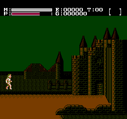

# FaxanaduRecomp

Static recompilation of Faxanadu (NES) for native PC.
Built with the [NESRecomp](https://github.com/mstan/nesrecomp) framework.

> **Status: Playable.** The game runs from title screen through credits. No outstanding known bugs. Not 100% playtested — minor edge cases may exist, but normal gameplay is fully functional.

[](https://www.youtube.com/watch?v=lLXSnK3HVW4)

## Quick Start

1. Download `FaxanaduRecomp-windows-x64.zip` from [Releases](../../releases)
2. Extract and run `FaxanaduRecomp.exe`
3. Select your Faxanadu (USA) ROM when prompted — the path is saved for future launches

## Controls

| NES Button | Keyboard |
|------------|----------|
| D-Pad      | Arrow keys |
| A          | Z |
| B          | X |
| Start      | Enter |
| Select     | Right Shift |

## Mantra (Password) Features

Faxanadu uses a mantra system instead of battery-backed saves. FaxanaduRecomp adds convenience features around this:

**Auto-load** — On startup, the game reads `saves.txt` (next to the exe) and auto-fills the most recent mantra on the password entry screen. No need to write down or retype passwords.

**CLI override** — `--password STRING` overrides the `saves.txt` mantra for a single session.

```
FaxanaduRecomp.exe [ROM] --password "k8fPcv?,TwSYzGZQhMIQhCEA"
```

**saves.txt format** — One mantra per line, most recent first. Human-readable and copy-pasteable. You can edit this file manually to add or change your saved mantra.

> **Note:** Auto-saving mantras from the priest dialog is not yet implemented. For now, write the mantra shown by the priest into `saves.txt` manually, or pass it via `--password`.

## Save States

| Key | Action |
|-----|--------|
| F5  | Toggle turbo (fast-forward) |
| F6  | Save state → `C:\temp\quicksave.sav` |
| F7  | Load state ← `C:\temp\quicksave.sav` |

## ROM

| Field | Value |
|-------|-------|
| Title | Faxanadu (USA) |
| CRC32 | `42C4EC66` |
| MD5   | `e224bf737cf9bab9df01173ef0bbff65` |
| SHA-1 | `34690743679841e67f88cc4973de97e86136ac0b` |

## Building from Source

Prerequisites: Windows 10+, Visual Studio 2022, CMake 3.20+ (SDL2 is bundled)

```
git clone --recurse-submodules https://github.com/mstan/FaxanaduRecomp
cmake -S . -B build -G "Visual Studio 17 2022" -A x64
cmake --build build --config Release
```

## Architecture

This is a **static recompiler**, not an emulator. The 6502 machine code in the ROM
has been translated to C by [NESRecomp](nesrecomp/) and compiled to native x64.

| File | Purpose |
|------|---------|
| `extras.c` | Faxanadu-specific hooks (mantra injection, auto-load) |
| `game.cfg` | Recompiler config (dispatch tables, trampolines) |
| `baserom_annotations.csv` | Address annotations for generated code |
| `generated/faxanadu_full.c` | Recompiled 6502 code (committed) |
| `generated/faxanadu_dispatch.c` | Dispatch table (committed) |
| `reference/` | Reference screenshots for visual regression |
