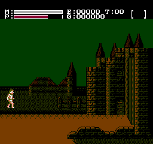

# FaxanaduRecomp

> _This recompilation is a **byproduct of developing
> [nesrecomp](https://github.com/mstan/nesrecomp)** — the games are the proving ground, the framework is the goal.
> **These are in-development previews, not finished ports — expect rough
> edges**, and depth will keep landing over months, not days. My time for any
> one title is limited, so I ask for your patience. Contributions are welcome —
> testing, issues, and PRs to the game or framework all help and will
> accelerate this game's polish. More on the why at:
> [Recomp + AI: 5 Months Later »](https://1379.tech/recomp-ai-5-months-later/)_

Static recompilation of Faxanadu (NES) for native PC.
Built with the [NESRecomp](https://github.com/mstan/nesrecomp) framework.

> **Status: Playable.** The game runs from title screen through credits. No outstanding known bugs. Not 100% playtested — minor edge cases may exist, but normal gameplay is fully functional.

[](https://www.youtube.com/watch?v=lLXSnK3HVW4)

## Quick Start

1. Download `FaxanaduRecomp-windows-x64.zip` from [Releases](../../releases)
2. Extract and run `FaxanaduRecomp.exe`
3. Select your Faxanadu (USA) ROM when prompted — the path is saved for future launches

## Controls

| NES Button | Keyboard |
|------------|----------|
| D-Pad      | Arrow keys |
| A          | Z |
| B          | X |
| Start      | Enter |
| Select     | Right Shift |

## Mantra (Password) Features

Faxanadu uses a mantra system instead of battery-backed saves. FaxanaduRecomp adds convenience features around this:

**Auto-load** — On startup, the game reads `saves.txt` (next to the exe) and auto-fills the most recent mantra on the password entry screen. No need to write down or retype passwords.

**CLI override** — `--password STRING` overrides the `saves.txt` mantra for a single session.

```
FaxanaduRecomp.exe [ROM] --password "k8fPcv?,TwSYzGZQhMIQhCEA"
```

**saves.txt format** — One mantra per line, most recent first. Human-readable and copy-pasteable. You can edit this file manually to add or change your saved mantra.

> **Note:** Auto-saving mantras from the priest dialog is not yet implemented. For now, write the mantra shown by the priest into `saves.txt` manually, or pass it via `--password`.

## Save States

| Key | Action |
|-----|--------|
| F5  | Toggle turbo (fast-forward) |
| F6  | Save state → `C:\temp\quicksave.sav` |
| F7  | Load state ← `C:\temp\quicksave.sav` |

## ROM

| Field | Value |
|-------|-------|
| Title | Faxanadu (USA) |
| CRC32 | `57DD23D1` (ROM data only, iNES header excluded) |
| MD5   | `b3bb9296b5e1e0c83e90b6da9e8a41aa` (ROM data only) |
| SHA-1 | `5b05c8859f356013d37f0545f5de5fa1693da5da` (ROM data only) |

## Experimental 3D Voxel Diorama

Open **Mods** in the launcher and enable **3D Voxel Diorama**. The bundled
feature is disabled by default. Dense floors, walls, and architecture receive
full depth; ladders, windows, and façade linework stay shallow; characters
remain oriented sprite cards with contact shadows. Dialogue, title, and mantra
panels stay in their authored 2D presentation.

Numpad 8/2 adjusts pitch, 4/6 yaw, 7/9 roll, +/- zoom, and 1/3 sprite scale.
Numpad 0 toggles the live view and Numpad 5 restores package defaults.

## Building from Source

Prerequisites: Windows 10+, Visual Studio 2022, CMake 3.20+ (SDL2 is bundled)

```bash
git clone https://github.com/mstan/FaxanaduRecomp
cd FaxanaduRecomp

# Windows
setup.bat

# Linux / macOS
chmod +x setup.sh && ./setup.sh
```

This initializes the pinned [nesrecomp](https://github.com/mstan/nesrecomp)
submodule and links the Nestopia oracle core.

Then build:

```bash
cmake -S . -B build -G "Visual Studio 17 2022" -A x64
cmake --build build --config Release
```

## Architecture

This is a **static recompiler**, not an emulator. The 6502 machine code in the ROM
has been translated to C by [NESRecomp](nesrecomp/) and compiled to native x64.

| File | Purpose |
|------|---------|
| `extras.c` | Faxanadu-specific hooks (mantra injection, auto-load) |
| `game.cfg` | Recompiler config (dispatch tables, trampolines) |
| `baserom_annotations.csv` | Address annotations for generated code |
| `generated/faxanadu_full.c` | Recompiled 6502 code (committed) |
| `generated/faxanadu_dispatch.c` | Dispatch table (committed) |
| `reference/` | Reference screenshots for visual regression |

---

<p align="center">
  <sub><b>R.A.I.D. — Retro AI Development</b> · a Discord for AI-assisted retro reverse-engineering, decomp &amp; recomp</sub>
</p>

<p align="center">
  <a href="https://discord.gg/Ad9BwSzctP"></a>
</p>
